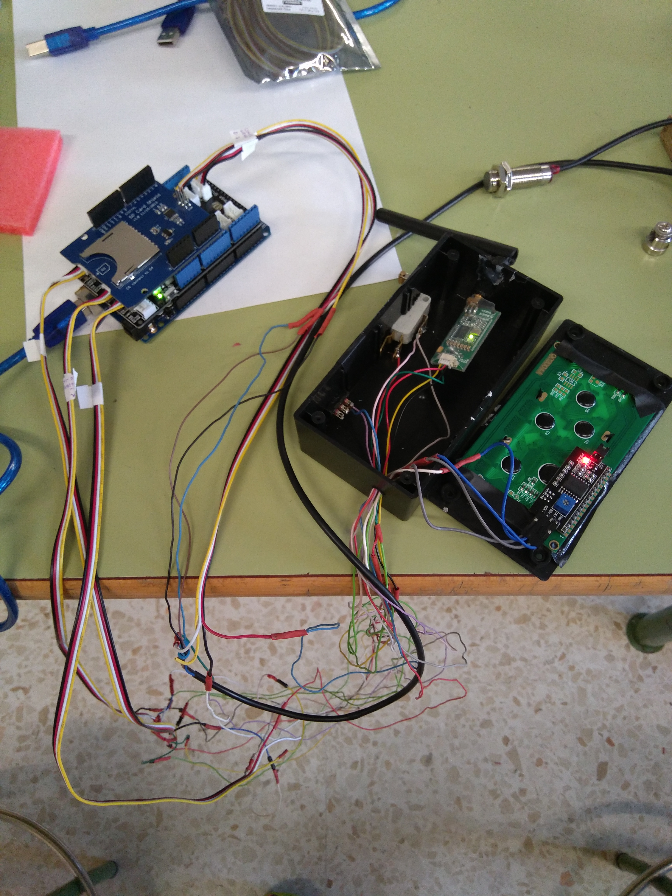
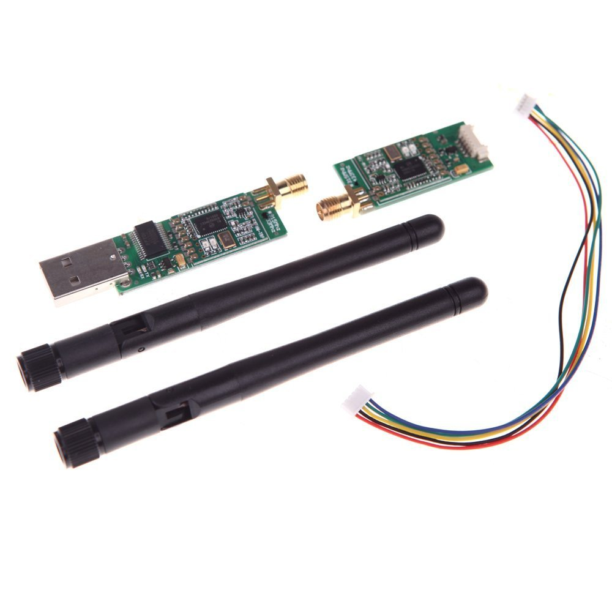
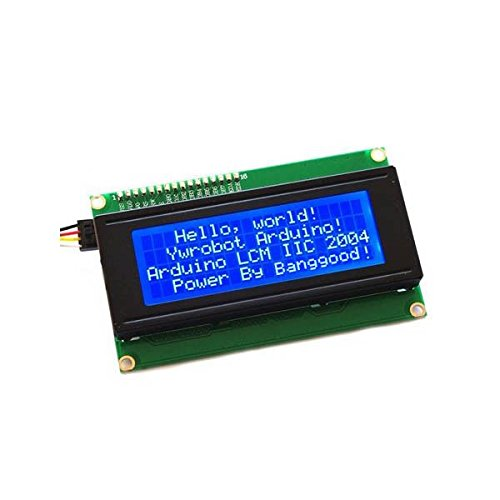
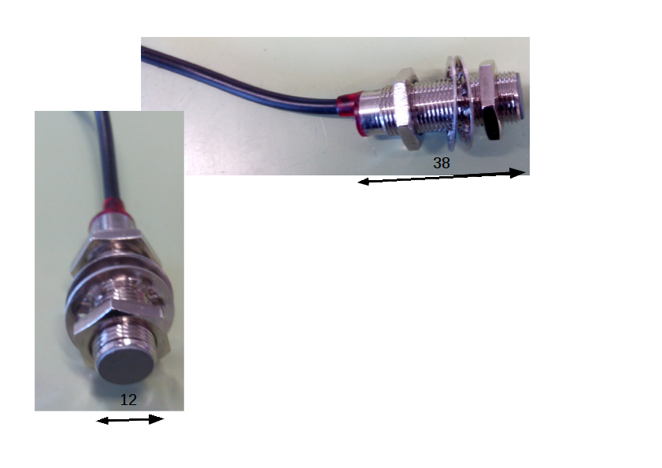
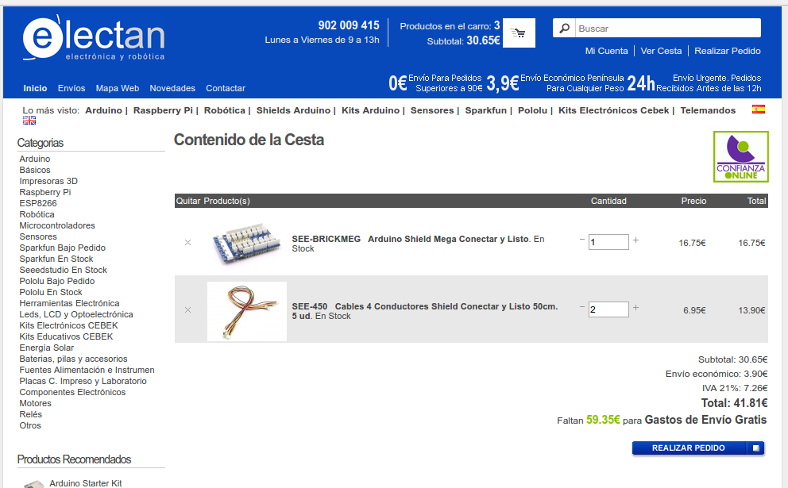
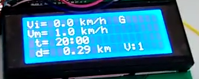

#LINCEDUINO
Desarrollo de linceduino, ayuda electrónica del lince.

##Objetivo
El objetivo de linceduino es proporcionar una herramienta que ayude al piloto y al equipo del LINCE a tener información en tiempo real y guardada en fichero de parámetros del vehículo como: tiempo transcurrido, velocidad instantánea, velocidad media, distancia, nº de vuelta y pulsación del botón de encendido de motor. Los datos se muestran en pantalla del piloto (lcd 20x4) se guardan en tarjeta SD y se transmiten mediante radiofrecuencia a PC.
##Hardware
Elementos físicos y conexionado:
- Arduino Mega.
- SD Shield.
- [Emisor de radiofrecuencia tipo 3DR Robotics](https://www.amazon.es/SODIAL-Telemetria-Quadcopter-Multirotor-robotica/dp/B0171NHADI/ref=sr_1_3?ie=UTF8&qid=1488274897&sr=8-3&keywords=3dr+robotic)   (con receptor a PC): rojo (5v), negro (gnd), amarillo (pin 17 RX2), verde (pin 16 TX2). 

- LCD I2C 20x4: GND (gnd), VCC (5v), SDA (pin 20), SCL (pin 21).

- Pulsador de marcha con resistencia de 10 K en serie: pata de pulsador a 5V, la otra a pin 19, resistencia una pata a pin 19 y la otra a GND.
- Conmutador de grabación y resistencia de 10K: Conmutador común a pin 7, otra pata del conmutador a 5v, resistencia de 10 K a pin y la otra pata de la resistencia a GND.
- Sensor magnético Hall: Negro a pin 2, marrón a 5V y azul a GND.

Además hemos comprado para realizar un conexionado más seguro un shield conectar y listo (tienda electan) con cables para que el conexionado de todos los elementos sea mucho más seguro.

###Montaje de Linceduino
<iframe width="854" height="480" src="https://www.youtube.com/embed/O8orDAbzBl0" frameborder="0" allowfullscreen></iframe>

##Software
Antes de nada tener un ordenador con ubuntu instalado.
Instalar en el las aplicaciones arduino, kst y Gtkterm, estas aplicaciones están en el centro de software.
Descripción de aplicaciones:
- Arduino: software para programar nuestro arduino Mega.
- Gtkterm: grabador y visualizador de comunicaciones por puerto serie, puerto por el que manda y recibe datos nuestro emisor y receptor de radiofrecuencia.
- KST: representador de datos en tiempo real a través de los datos recogidos en un fichero por Gtkterm.
En nuestro arduino además debemos de agregar una librería para poder operar con nuestro lcd 20x4 (20 columnas 2 filas) de tipo I2C (sólo necesita 4 cables, 2 de alimentación y 2 de datos).

###Programa de Arduino
~~~
#include <SPI.h>
#include <math.h>
#include <SD.h>
#include <Wire.h>  // Comes with Arduino IDE
#include <LiquidCrystal_I2C.h>
LiquidCrystal_I2C lcd(0x3F, 2, 1, 0, 4, 5, 6, 7, 3, POSITIVE);  // Set the LCD I2C address de 20x4

#define REFRESCO_SD 4 //Frecuencia de guardado
#define pinsd 4 // pin que marca el fabricante de SD Shield
Sd2Card card;// defino una variable card com Sd2CArd
float desarrollo=1492.6; // desarrollo de una vuelta del lince en mm
volatile float tiempopaso, tiempovuelta;//tiempo (hasta la activación del sensor y de una vuelta)
volatile float velocidad, velocidadm; //velocidades (instantánea y media)
volatile float distancia; //distancia recorrida desde que empieza a circular
volatile int lineasBuffer = 0; // lineas de buffer guardadas
volatile int nvueltas = 0; //vuelta de rueda
volatile bool marcha=false;// estado de pulsador de impulso
volatile long ultimamarcha=0;//tiempo que se pulso por ultima vez marcha
String minutos, segundos; //minutos y segundos desde el inicio
char s_string [10];
char m_string [10];
unsigned long tiempo1=0; //tiempo inicial
int vueltas; //vuelta del circuito
String buffer=""; // Almacenamiento temporal de datos recogidos de ISR, para la tarjeta SD
volatile int botonpulsado;// Botón para guardado
File dataFile; //Fichero para guardar datos
bool c = true; //Booleano para la representación

void setup() {

attachInterrupt(0, calculos, RISING);//pin de interrupción 2 arduino mega para sensor hall
attachInterrupt(4, calculosmarcha, CHANGE);//pin de interrupción 19 arduino mega: marcha
lcd.begin(20, 4); //iniciamos la pantalla lcd
lcd.setBacklight(1);
//lcd.backlight ();//da luz al fondo de pantalla de lcd
lcd.clear();
pinMode(pinsd, OUTPUT);
SD.begin(pinsd);//inicializa la SD (tiene que estar insertada) sólo lo hace una vez
lcd.setCursor(0,1);// pone el lcd en la posicion 0,1
if (card.init(SPI_HALF_SPEED, pinsd)) { 
  lcd.print("Tarjeta SD preparada");}
    // don't do anything more:
  //return;
 else {lcd.print("SD error o no inser.");}
lcd.setCursor (1,2); lcd.print ("(: VAMOS LINCE ;)");
delay (4000);
lcd.clear();
Serial2.begin (57600);//comunicacion por puerto serie2 de radiofrecuencia
//Serial.begin (9600);

}

void calculos() {
//Calcula los datos a representar
if (nvueltas==1) {tiempo1=millis();}
nvueltas++;
tiempovuelta=millis()-tiempopaso;//tiempo por vuelta
tiempopaso=millis();//tiempo desde que se produjo la interrupcion
velocidad=(desarrollo*3.6)/tiempovuelta; // (km/h), [mm/ms*3,6 para pasar a km/h]
velocidadm=(desarrollo*3.6*nvueltas)/(millis() - tiempo1);
distancia=(nvueltas*desarrollo)/1000000; //distancia total (km)
vueltas= int((distancia)/2.240)+1; // el circuito tiene 2240 m= 2.240 Km
//solo guarda en buffer y por tanto guarda en fichero cuando si se ha pulsado el boton select
if(botonpulsado==1 && nvueltas>2) {
guardabuffer();
}
}

void calculosmarcha() {
//Interrupción para pulsador 'marcha'
if ((millis()-ultimamarcha)>100 ) { 
marcha=!marcha;
ultimamarcha=millis();
if(botonpulsado==1) {
guardabuffer();}
}
}

void guardabuffer(){
//Guarda los datos temporalmente en un buffer
   buffer += String(int((millis()-tiempo1)/1000));buffer += ";";
   buffer += nf(velocidad,2,2);buffer += ";";
   buffer += nf(velocidadm,2,2);buffer += ";";
   buffer += nf(distancia,2,2);buffer += ";";
   buffer += vueltas;buffer += ";";
   buffer += marcha;buffer += "\n";
   lineasBuffer++;
}

void guardasd(){
//Guarda el buffer en un archivo
//SD.begin(pinsd);//inicializa la sd debe estar insertada
dataFile = SD.open("log0.txt", FILE_WRITE);

if (dataFile) {
dataFile.print(buffer);
//lineasBuffer = 0;
//buffer = "";
dataFile.close();
lcd.setCursor(16,0);
c = !c;
if(c) {lcd.print("|");}

else {lcd.print("-");}
}
else {}
}

String nf(float n, int cifras, int decimales) {// la funcion nf tiene como entrada una variable float, el numero de cifras enteras, y el numero de cifras decimales
char numero [10];//creamos la variable tipo char numero de longitud 10
return dtostrf(n,(cifras+decimales+1),decimales,numero);//dtostrf convierte a cadena el valor float n, le pasamos el nº total de caracteres, el nº de decimales, y la variable donde se guarda en nuestro caso numero 
//int punto = String(numero).indexOf("."); //calculamos la posicion del punto decimal
//String parte_entera = String(numero).substring(0,punto);//cortamos la parte entera de la variable numero y la guardamos en la variable parte_entera 
//String parte_decimal = String(numero).substring(punto+1);//cortamos la parte decimal de la variable numero y la guardamos en la variable parte_decimal 
//return parte_entera + "," + parte_decimal;//la funcion devuelve la union de la parte entera y la decimal separadas por coma, para ser tratada luego en una hoja de calculo
}

String tiempo() {
// Devuelve el tiempo de la forma ‘000:00’
dtostrf((millis()-tiempo1)/60000,3,0,m_string);//asigna a la variable m_string el numero de minutos dejandolo con tres enteros
dtostrf(((millis()-tiempo1) % 60000)/1000,1,0,s_string);
minutos = String(m_string);
segundos = String(s_string);
if (segundos.length() < 2) {segundos = "0" + segundos;}
return minutos + ":" + segundos;
}

void loop() {
//Bucle principal. Representa y reinicia variables

botonpulsado=digitalRead (7);// controla el guardado de datos con el conmutador
if (nvueltas==1) {tiempo1=millis();}
if (lineasBuffer >= REFRESCO_SD) {Serial2.print (buffer);guardasd();lineasBuffer = 0;buffer="";}

lcd.setCursor(0,0);
lcd.print("Vi=");
if((millis()-tiempopaso) < 3000) {if (velocidad<100) {
lcd.setCursor(3,0);
lcd.print(nf(velocidad,2,1));
}} //si la velocidad es > 100 no representa}
else {lcd.print(" 0.0");}

lcd.setCursor(8,0);
lcd.print("km/h");

lcd.setCursor(0,1);
lcd.print("Vm=");

if (velocidadm<100) {
lcd.setCursor(3,1);
lcd.print(nf(velocidadm,2,1));}

lcd.setCursor(8,1);
lcd.print("km/h");

lcd.setCursor(14,0);
if (botonpulsado==1) {lcd.print("G");}
else {lcd.print("N");}

lcd.setCursor(14,3);
if (vueltas<=7) {
lcd.print("V:");
lcd.setCursor(16,3);
lcd.print(vueltas);}
else {lcd.print("FINAL");}

lcd.setCursor(1,3);
lcd.print("d=");

lcd.setCursor(3,3);
lcd.print(nf(distancia,3,2));

lcd.setCursor(10,3);
lcd.print("km");

lcd.setCursor(1,2);
lcd.print("t=");

lcd.setCursor(3,2);
lcd.print(tiempo());

lcd.setCursor(14,1);
//lcd.print (marcha);
if((velocidad>100 || velocidadm>100) && nvueltas>2){lcd.print("ERROR");}
else{lcd.print("     ");}

delay(200);
}
~~~
##Manual de uso
Cuestiones a tener en cuenta a la hora de hacer funcionar a Linceduino.
###LCD

- 1ª Fila: Velocidad instántanea, caracter de guardado (N o G) según como esté el conmutador de grabación
- 2ª fila: Velocidad media, mensaje de "ERROR" si las velocidades medias o instantánea son superiores a 100 Km/h
- 3ª FIla: tiempo en h/m/s
- 4ª Fila: distancia, nº de vuelta (indica final si es la última)

### Secuencia de uso
1. Se inserta SD limpia
2. Se alimenta a Linceduino. El tiempo empieza a contar en LCD pero no computa. Cuando la rueda da la primera vuelta (pasa por el sensor) el tiempo se pone a 0 y empieza a contar el verdadero tiempo de computo.
3. Con el conmutador de guardado puedo elegir que guarde y transmita datos o que no lo haga, caracteres N o G del LCD.

### Visualización de datos de SD
En breve

### Visualización de datos en tiempo real
En breve

##Vídeos Linceduino
Os enlazamos veos de interés sobre linceduino.
- [Linceduino 1](https://www.youtube.com/watch?v=OVWAux1UXQ8)
- [Linceduino 2 dispositvos y telemetría](https://www.youtube.com/watch?v=JQcPb2iFT0I) 
- [Software telemetría Linceduino 2](https://www.youtube.com/watch?v=axf5u40hDhU) 
- [Montaje Linceduino 2](https://www.youtube.com/watch?v=O8orDAbzBl0) 

