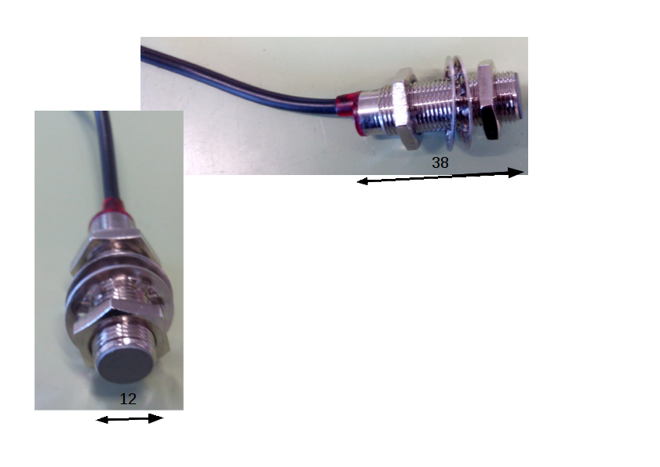
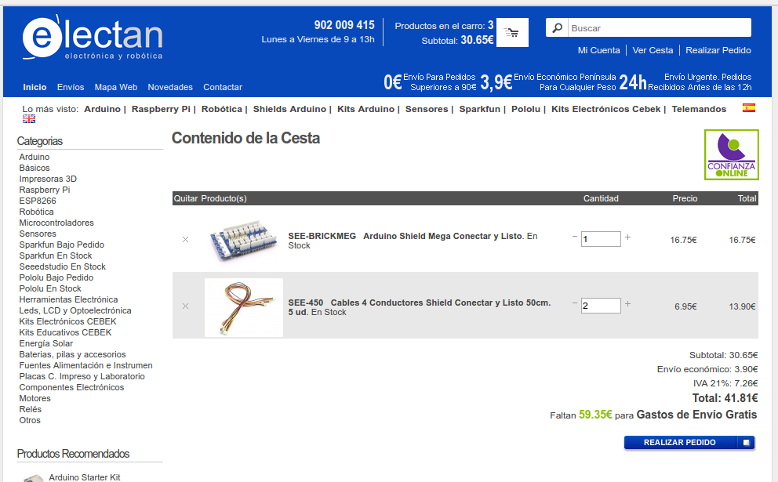

#LINCEDUINO
Desarrollo de linceduino, ayuda electrónica del lince.

##Objetivo
El objetivo de linceduino es proporcionar una herramienta que ayude al piloto y al equipo del LINCE a tener información en tiempo real y guardada en fichero de parámetros del vehículo como: tiempo transcurrido, velocidad instantánea, velocidad media, distancia, nº de vuelta y pulsación del botón de encendido de motor. Los datos se muestran en pantalla del piloto (lcd 20x4) se guardan en tarjeta SD y se transmiten mediante radiofrecuencia a PC.
##Hardware
Elementos físicos y conexionado:
- Arduino Mega.
- SD Shield.
- [Emisor de radiofrecuencia tipo 3DR Robotics](https://www.amazon.es/SODIAL-Telemetria-Quadcopter-Multirotor-robotica/dp/B0171NHADI/ref=sr_1_3?ie=UTF8&qid=1488274897&sr=8-3&keywords=3dr+robotic)   (con receptor a PC): rojo (5v), negro (gnd), amarillo (pin 17 RX2), verde (pin 16 TX2). 

- LCD I2C 20x4: GND (gnd), VCC (5v), SDA (pin 20), SCL (pin 21).

- Pulsador de marcha con resistencia de 10 K en serie: pata de pulsador a 5V, la otra a pin 19, resistencia una pata a pin 19 y la otra a GND.
- Conmutador de grabación y resistencia de 10K: Conmutador común a pin 7, otra pata del conmutador a 5v, resistencia de 10 K a pin y la otra pata de la resistencia a GND.
- Sensor magnético Hall: Negro a pin 2, marrón a 5V y azul a GND.

Además hemos comprado para realizar un conexionado más seguro un shield conectar y listo (tienda electan) con cables para que el conexionado de todos los elementos sea mucho más seguro.

